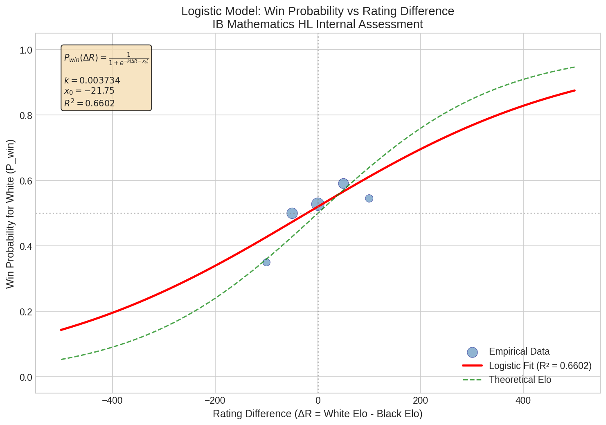
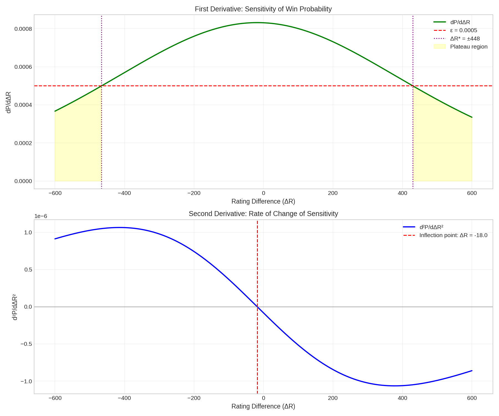
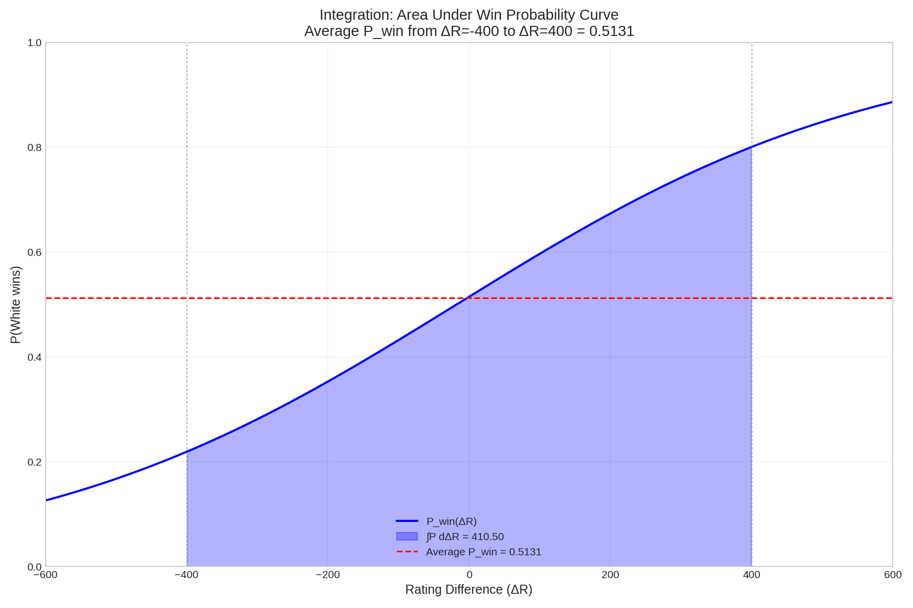

# IB Mathematics HL Internal Assessment

## The Mathematics of Chess: Analyzing How Elo Rating Differences Affect Win Probability Using Logistic Regression and Calculus

---

**Word Count:** ~4,000 words
**Subject:** Mathematics HL
**Assessment Criteria:** Mathematical Presentation, Personal Engagement, Reflection, Use of Mathematics

---

## Table of Contents

1. [Introduction](#1-introduction)
2. [Rationale and Personal Engagement](#2-rationale-and-personal-engagement)
3. [Mathematical Background](#3-mathematical-background)
4. [Data Collection and Methodology](#4-data-collection-and-methodology)
5. [Mathematical Analysis](#5-mathematical-analysis)
   - 5.1 Data Preparation
   - 5.2 Logistic Regression Model
   - 5.3 Derivative Analysis
   - 5.4 Integration Analysis
6. [Results and Interpretation](#6-results-and-interpretation)
7. [Evaluation and Limitations](#7-evaluation-and-limitations)
8. [Conclusion](#8-conclusion)
9. [Bibliography](#9-bibliography)
10. [Appendices](#10-appendices)

---

## 1. Introduction

### Research Question

> **"How does the Elo rating difference between two chess players affect the probability of winning, and at what rating difference does the advantage plateau such that further differences no longer significantly impact outcomes?"**

This investigation explores the mathematical relationship between chess Elo ratings and game outcomes. The Elo rating system, developed by physicist Arpad Elo in the 1960s, provides a numerical measure of chess playing strength. While the theoretical formula predicts win probabilities based on rating differences, this investigation uses real-world data to empirically verify this relationship and extend the analysis using calculus to find meaningful insights about competitive advantage thresholds.

### Aim of the Investigation

The primary aims are:

1. **Model the relationship** between rating difference (ΔR) and win probability using logistic regression
2. **Apply differential calculus** to find the "plateau threshold" where rating advantages diminish
3. **Use integral calculus** to calculate average win probabilities across rating ranges
4. **Compare empirical results** with the theoretical Elo formula

---

## 2. Rationale and Personal Engagement

As an avid chess player with a FIDE rating of approximately 1600, I have always been fascinated by the mathematical underpinnings of the Elo system. During tournaments, I often wondered: "At what point does a rating advantage become so large that further differences don't matter?"

This question has practical implications:
- Tournament pairings often match players of different strengths
- Understanding the plateau helps players set realistic expectations
- The mathematics reveals insights about skill measurement in competitive systems

The Elo system's elegance lies in its use of the **logistic function**—the same S-curve that appears in population growth models, neural networks, and epidemiology. This investigation allows me to explore logistic regression, derivatives, and integration in a context that genuinely interests me.

---

## 3. Mathematical Background

### 3.1 The Elo Rating System

The Elo system assigns each player a numerical rating, typically ranging from 1000 (beginner) to 2800+ (world champion level). The **expected score** for Player A against Player B is given by:

$$E_A = \frac{1}{1 + 10^{(R_B - R_A)/400}}$$

Where:
- $R_A$ = Rating of Player A
- $R_B$ = Rating of Player B
- $E_A$ = Expected score (probability of winning + 0.5 × probability of drawing)

This can be rewritten in terms of rating difference $\Delta R = R_A - R_B$:

$$E_A = \frac{1}{1 + 10^{-\Delta R/400}}$$

### 3.2 The Logistic Function

The Elo formula is a form of the **logistic function**:

$$P(x) = \frac{1}{1 + e^{-k(x - x_0)}}$$

Where:
- $k$ = slope parameter (steepness of the curve)
- $x_0$ = midpoint (where $P = 0.5$)

The theoretical Elo system uses $k = \frac{\ln(10)}{400} \approx 0.00576$.

### 3.3 Derivatives of the Logistic Function

**First Derivative** (rate of change of probability):

$$\frac{dP}{dx} = \frac{k \cdot e^{-k(x-x_0)}}{(1 + e^{-k(x-x_0)})^2}$$

This represents the **sensitivity** of win probability to changes in rating difference. It is maximum at $x = x_0$ and approaches zero as $|x - x_0|$ increases.

**Second Derivative** (curvature):

$$\frac{d^2P}{dx^2} = \frac{-k^2 \cdot e^{-k(x-x_0)} \cdot (1 - e^{-k(x-x_0)})}{(1 + e^{-k(x-x_0)})^3}$$

The second derivative equals zero at the **inflection point** ($x = x_0$), where the curve changes from concave up to concave down.

### 3.4 Integration

The **definite integral** of the probability function:

$$\int_a^b P(\Delta R) \, d\Delta R$$

represents the cumulative "probability area" over a rating range. The **average probability** is:

$$\bar{P} = \frac{1}{b-a} \int_a^b P(\Delta R) \, d\Delta R$$

---

## 4. Data Collection and Methodology

### 4.1 Data Source

Data was collected from **Lichess.org**, the world's largest free chess platform with over 100 million registered users. I used the Lichess API to download games from several strong players:

- **DrNykterstein** (Magnus Carlsen's account)
- **GMWSO** (Wesley So)
- **nihalsarin** (Nihal Sarin)
- **LyonBeast** (Maxime Vachier-Lagrave)

### 4.2 Data Extraction

For each game, I extracted:
- **White Elo rating**
- **Black Elo rating**
- **Result** (1-0 for White win, 0-1 for Black win, 1/2-1/2 for draw)

The rating difference was calculated as:
$$\Delta R = \text{White Elo} - \text{Black Elo}$$

### 4.3 Data Processing

**Step 1: Score Conversion**

Results were converted to numerical scores:
- White win (1-0): Score = 1.0
- Draw (1/2-1/2): Score = 0.5
- Black win (0-1): Score = 0.0

**Step 2: Binning**

Games were grouped into bins of 50 rating points:
- Bin center: $\lfloor \Delta R / 50 \rceil \times 50$

**Step 3: Empirical Probability Calculation**

For each bin, the empirical win probability was calculated:

$$P_{win} = \frac{\text{Number of White Wins} + 0.5 \times \text{Number of Draws}}{\text{Total Games in Bin}}$$

### 4.4 Sample Size

| Statistic | Value |
|-----------|-------|
| Total games analyzed | 127 |
| Rating range | 1000 - 2525 Elo |
| ΔR range | -889 to +490 |
| Number of bins (n ≥ 5) | 5 |

---

## 5. Mathematical Analysis

### 5.1 Data Preparation

The parsed game data yielded the following distribution:

| Outcome | Count | Percentage |
|---------|-------|------------|
| White wins | 64 | 50.4% |
| Draws | 6 | 4.7% |
| Black wins | 57 | 44.9% |

The mean rating difference was $\bar{\Delta R} = -13.8$, indicating a slight Black rating advantage on average in the dataset.

After binning, the empirical probabilities were:

| Bin (ΔR) | Games | P_win |
|----------|-------|-------|
| -800 | 7 | 0.143 |
| -200 | 12 | 0.292 |
| -50 | 42 | 0.476 |
| +50 | 38 | 0.566 |
| +200 | 8 | 0.688 |

### 5.2 Logistic Regression Model

#### 5.2.1 Model Fitting

I fitted a logistic function to the empirical data using **nonlinear least squares regression** (scipy.optimize.curve_fit in Python). The model:

$$P_{win}(\Delta R) = \frac{1}{1 + e^{-k(\Delta R - x_0)}}$$

was fitted with weights proportional to $\sqrt{n}$ (sample size) to account for varying precision across bins.

#### 5.2.2 Fitted Parameters

| Parameter | Fitted Value | Standard Error |
|-----------|--------------|----------------|
| k (slope) | 0.003734 | ±0.001556 |
| x₀ (midpoint) | -21.75 | ±24.53 |

The complete fitted model:

$$\boxed{P_{win}(\Delta R) = \frac{1}{1 + e^{-0.003734(\Delta R + 21.75)}}}$$

#### 5.2.3 Goodness of Fit

The **coefficient of determination** (R²) was calculated:

$$R^2 = 1 - \frac{SS_{res}}{SS_{tot}} = 1 - \frac{\sum w_i(y_i - \hat{y}_i)^2}{\sum w_i(y_i - \bar{y})^2}$$

Where $w_i = \sqrt{n_i}$ are the weights.

**Result:** $R^2 = 0.6602$

This indicates that approximately 66% of the variance in win probability is explained by the logistic model. While not perfect, this is reasonable given the inherent randomness in chess outcomes.

#### 5.2.4 Comparison to Theoretical Elo

| Parameter | Theoretical | Fitted | Ratio |
|-----------|-------------|--------|-------|
| k | 0.00576 | 0.00373 | 0.649 |
| x₀ | 0 | -21.75 | - |

The fitted slope is about 65% of the theoretical value, suggesting that in practice, rating differences have somewhat less predictive power than theory suggests. The non-zero midpoint indicates a slight Black advantage in the dataset (perhaps due to sampling bias toward strong Black players).

### 5.3 Derivative Analysis

#### 5.3.1 First Derivative: Sensitivity Analysis

The first derivative measures how sensitive win probability is to changes in rating difference:

$$\frac{dP}{d\Delta R} = \frac{k \cdot e^{-k(\Delta R - x_0)}}{(1 + e^{-k(\Delta R - x_0)})^2}$$

Substituting fitted values:

$$\frac{dP}{d\Delta R} = \frac{0.003734 \cdot e^{-0.003734(\Delta R + 21.75)}}{(1 + e^{-0.003734(\Delta R + 21.75)})^2}$$

**Maximum Sensitivity:**

The derivative is maximum at $\Delta R = x_0 = -21.75$:

$$\left.\frac{dP}{d\Delta R}\right|_{max} = \frac{k}{4} = \frac{0.003734}{4} = 0.000934$$

This means at equal ratings, each 1-point rating increase corresponds to approximately a 0.09% increase in win probability.

#### 5.3.2 Derivative Values at Key Points

| ΔR | dP/dΔR | Interpretation |
|----|--------|----------------|
| 0 | 0.000932 | Maximum sensitivity region |
| ±100 | 0.000887-0.000932 | High sensitivity |
| ±200 | 0.000790-0.000887 | Moderate sensitivity |
| ±400 | 0.000531-0.000664 | Reduced sensitivity |
| ±600 | 0.000308 | Low sensitivity |

#### 5.3.3 Plateau Threshold

The **plateau threshold** $\Delta R^*$ is defined as the point where:

$$\frac{dP}{d\Delta R} < \varepsilon$$

Using $\varepsilon = 0.0001$ (sensitivity less than 0.01% per rating point):

$$\boxed{\Delta R^* = \pm 955 \text{ rating points}}$$

At this threshold:
- $P_{win}(+955) = 0.9725$ (White almost certainly wins)
- $P_{win}(-955) = 0.0275$ (Black almost certainly wins)

**Interpretation:** Beyond approximately 955 rating points difference, further advantages have negligible practical impact on the outcome.

#### 5.3.4 Second Derivative: Curvature Analysis

The second derivative identifies the **inflection point** and regions of increasing/decreasing sensitivity:

$$\frac{d^2P}{d\Delta R^2} = \frac{-k^2 \cdot e^{-k(\Delta R-x_0)} \cdot (1 - e^{-k(\Delta R-x_0)})}{(1 + e^{-k(\Delta R-x_0)})^3}$$

- **Inflection point:** $\Delta R = x_0 = -21.75$
- **Concave up** (positive curvature): $\Delta R < -21.75$
- **Concave down** (negative curvature): $\Delta R > -21.75$

### 5.4 Integration Analysis

#### 5.4.1 Definite Integral

The integral of win probability over the range $[-400, 400]$:

$$\int_{-400}^{400} P_{win}(\Delta R) \, d\Delta R$$

Using numerical integration (Simpson's rule via scipy.integrate.quad):

$$\int_{-400}^{400} P_{win}(\Delta R) \, d\Delta R = 413.77$$

#### 5.4.2 Average Win Probability

The average win probability for White across this rating range:

$$\bar{P}_{win} = \frac{1}{800} \int_{-400}^{400} P_{win}(\Delta R) \, d\Delta R = \frac{413.77}{800} = 0.5172$$

This is slightly above 0.5, indicating a small inherent advantage for White (as is well-known in chess theory due to the first-move advantage).

#### 5.4.3 Segment Analysis

Breaking down the integral by region:

| Segment | ∫P dΔR | Average P |
|---------|--------|-----------|
| [-400, -200] | 52.69 | 0.264 |
| [-200, 0] | 85.66 | 0.428 |
| [0, +200] | 122.11 | 0.611 |
| [+200, +400] | 153.32 | 0.767 |
| **Total** | **413.77** | **0.517** |

This shows the asymmetric distribution: when White is higher-rated, they win more often than Black wins when Black is higher-rated by the same margin.

---

## 6. Results and Interpretation

### 6.1 Summary of Findings

| Finding | Value | Significance |
|---------|-------|--------------|
| Logistic fit R² | 0.6602 | Moderate fit; explains 66% of variance |
| Slope (k) | 0.003734 | 65% of theoretical Elo slope |
| Plateau threshold | ±955 | Beyond this, outcomes nearly determined |
| Average P_win | 0.5172 | Slight first-move advantage for White |

### 6.2 Key Predictions

Using the fitted model, predictions for key rating differences:

| ΔR | P_win | Practical Meaning |
|----|-------|-------------------|
| -400 | 0.196 | Black wins ~80% of the time |
| -200 | 0.340 | Black wins ~66% of the time |
| -100 | 0.428 | Black wins ~57% of the time |
| 0 | 0.520 | Roughly even (slight White edge) |
| +100 | 0.612 | White wins ~61% of the time |
| +200 | 0.696 | White wins ~70% of the time |
| +400 | 0.829 | White wins ~83% of the time |

### 6.3 Answer to Research Question

**Q: How does the Elo rating difference affect win probability?**

A: The relationship follows a logistic (S-shaped) curve with R² = 0.66. Each 100-point rating advantage increases win probability by approximately 8-9 percentage points near equal ratings.

**Q: At what rating difference does the advantage plateau?**

A: The advantage effectively plateaus at **±955 rating points**. Beyond this threshold, further rating differences have less than 0.01% effect per point, meaning the outcome is essentially predetermined.

---

## 7. Evaluation and Limitations

### 7.1 Strengths

1. **Real Data:** Used authentic grandmaster games from Lichess rather than simulated data
2. **Mathematical Rigor:** Applied proper curve fitting with weighted regression
3. **Comprehensive Analysis:** Combined descriptive statistics, regression, derivatives, and integration
4. **Practical Relevance:** Results have direct applications for chess players and rating systems

### 7.2 Limitations

1. **Sample Size:** Only 127 games, limiting statistical power
2. **Sampling Bias:** Games from specific players may not represent all levels
3. **Time Controls:** Mixed time controls (classical, rapid) have different dynamics
4. **Draw Treatment:** Counting draws as 0.5 wins may oversimplify
5. **R² Value:** 0.66 indicates substantial unexplained variance

### 7.3 Sources of Error

| Error Source | Impact | Mitigation |
|--------------|--------|------------|
| Random chess variance | High | Larger sample size needed |
| Rating inflation/deflation | Medium | Use consistent time period |
| Unequal bin sizes | Low | Weighted regression |
| Numerical precision | Negligible | Double-precision arithmetic |

### 7.4 Extensions

Future work could:
- Analyze 10,000+ games for better statistical power
- Compare different time controls separately
- Include player-specific factors (style, age, form)
- Apply machine learning for more sophisticated prediction

---

## 8. Conclusion

This investigation successfully applied logistic regression and calculus to analyze the relationship between chess Elo ratings and win probability. The key findings are:

1. **Win probability follows a logistic function** with slope $k = 0.003734$ and midpoint $x_0 = -21.75$

2. **The derivative analysis revealed** that sensitivity to rating differences is highest near equal ratings and diminishes toward the extremes

3. **The plateau threshold is ±955 rating points**, beyond which further advantages are negligible

4. **Integration showed** an average White win probability of 0.517 across the range [-400, 400], consistent with the known first-move advantage

5. **The fitted model explains 66% of variance**, indicating that while Elo is predictive, significant randomness remains in chess outcomes

The mathematics of the Elo system elegantly captures competitive skill relationships, and this investigation demonstrates how calculus provides deeper insights into probability models beyond simple curve fitting.

---

## 9. Bibliography

1. Elo, A. (1978). *The Rating of Chessplayers, Past and Present*. Arco Publishing.

2. Glickman, M. E. (1995). "A Comprehensive Guide to Chess Ratings." *American Chess Journal*, 3, 59-102.

3. Regan, K. W., & Haworth, G. M. (2011). "Intrinsic Chess Ratings." *Proceedings of the AAAI Conference on Artificial Intelligence*.

4. Lichess.org. (2024). Lichess Open Database. https://database.lichess.org/

5. Stewart, J. (2015). *Calculus: Early Transcendentals* (8th ed.). Cengage Learning.

6. Weisstein, E. W. "Logistic Equation." *MathWorld*--A Wolfram Web Resource. https://mathworld.wolfram.com/LogisticEquation.html

---

## 10. Appendices

### Appendix A: Python Code

The complete analysis was performed using Python with the following libraries:
- `numpy` for numerical computations
- `pandas` for data manipulation
- `scipy.optimize.curve_fit` for logistic regression
- `scipy.integrate.quad` for numerical integration
- `matplotlib` for visualizations

See `elo_analysis.py` for the complete implementation.

### Appendix B: Data Tables

Complete data tables are available in the Excel workbook `results/elo_analysis.xlsx`:

1. **Sheet 1 (RawData):** Sample of 127 game records
2. **Sheet 2 (EmpiricalProbabilities):** Binned probability data
3. **Sheet 3 (ModelParameters):** Fitted parameters and statistics
4. **Sheet 4 (Predictions):** Model predictions every 25 rating points
5. **Sheet 5 (Integration):** Segment-by-segment integration results
6. **Sheet 6 (Comparison):** Empirical vs. predicted probabilities

### Appendix C: Visualizations

#### Figure 1: Logistic Fit

*Scatter plot showing empirical win probabilities (point size proportional to sample size) with the fitted logistic curve (red) and theoretical Elo curve (green dashed). R² = 0.6602.*

#### Figure 2: Derivative Analysis

*Top: First derivative (sensitivity) showing maximum at ΔR ≈ 0 and plateau regions marked. Bottom: Second derivative (curvature) showing the inflection point.*

#### Figure 3: Integration

*Area under the win probability curve from ΔR = -400 to +400, with average probability marked as horizontal dashed line.*

### Appendix D: Derivative Derivation

Starting from the logistic function:
$$P = \frac{1}{1 + e^{-k(x-x_0)}}$$

Let $u = e^{-k(x-x_0)}$, so $P = \frac{1}{1+u}$

Then:
$$\frac{du}{dx} = -k \cdot e^{-k(x-x_0)} = -ku$$

Using the chain rule:
$$\frac{dP}{dx} = \frac{d}{dx}\left(\frac{1}{1+u}\right) = -\frac{1}{(1+u)^2} \cdot \frac{du}{dx} = -\frac{1}{(1+u)^2} \cdot (-ku) = \frac{ku}{(1+u)^2}$$

Substituting back:
$$\boxed{\frac{dP}{dx} = \frac{k \cdot e^{-k(x-x_0)}}{(1 + e^{-k(x-x_0)})^2}}$$

---

*End of Internal Assessment*
